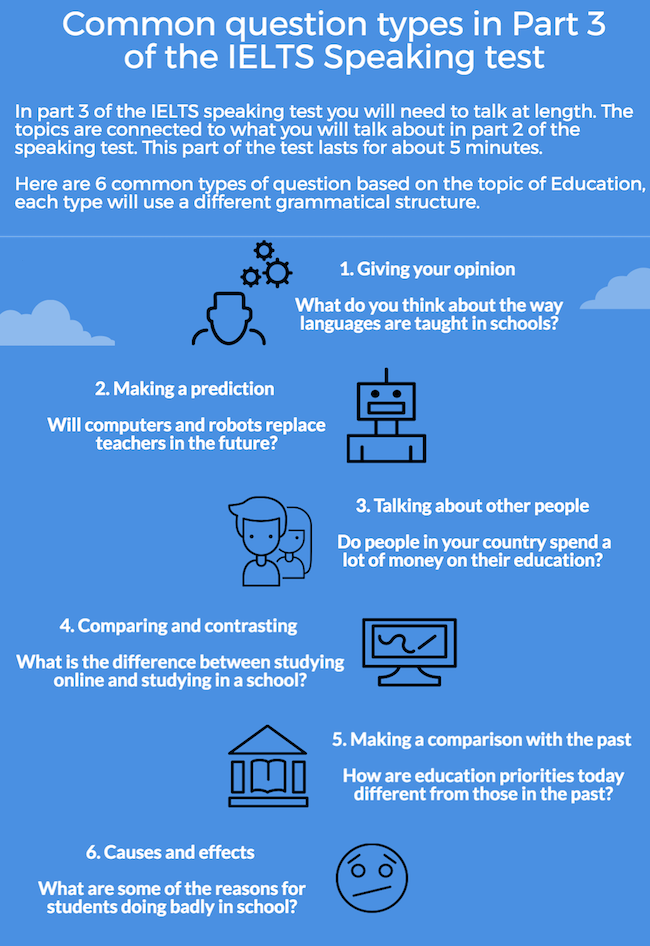

### Technique > Speaking Part 3

1. Time Buyers

   Phrases that can be used include:

   That's a difficult question, let me think for a second.

   That's a very intresting question, let me think.

   It's very difficult to know exactly, but I think I believe/perhaps

   It's difficult to say, I think...

   I don't really know for sure, but I would say...

   **Not not overuse these phrases**

2. Paraphrase Question

   *Examiner*: What can people do to try and reduce water pollution?

   *Student*: So, what can individuals do to ensure water is kept clean? I think….

3. Explain why

   *Examiner*: What can people do to reduce water pollution?

   *Student*: I believe the best way to keep water clean is to curb water use at home. (Why?) The vast majority of water is used in the home, (why?), for cooking, cleaning and washing, (why?) therefore by reducing the amount of water we use, (why?) the government can conserve the water supply and keep it clean.

4. Give examples

   *Examiner*: Have the modes of transport people use in your country changed much over the last few decades?

   *Student*: Absolutely**,** they have changed a lot. In the past most people used bicycles, but now they predominantly use motorbikes. **For example**, a recent survey found that 72% of people in Ho Chi. Minh City now own a motorbike.

5. Make Concessions

   We use words like ‘**however**’, ‘**on the other hand**’ and ‘**despite this’** to make concessions.

   *Examiner*: To what extent do you think advertising affects people’s shopping habits?

   *Student*: Personally, I don’t think that it affects the way people shop at all. When people need something they make up their own mind rather than thinking about adverts. However, it must have some influence, if companies pay lots of money for ads.

   On the other hand, many people believe the opposite is true, and it has influence …

### Technique > Multiple Choice Questions

1. Read the questions
2. Skim read the text, get the general meaning
3. Identify key words
4. think about meaning, find the synonyms
5. Predict the correct answer
6. Read the text again
7. Deciding between similar answers
   * Paraphrase each one in your won words
   * Identify distractors such as qualifying words that give them different meaning
   * Compare keywords and synonyms between them and with the question

### Practies materials

https://www.examword.com/ielts-spell/500-vocabulary-1?la=en&nu=0

English Basic Synonyms
